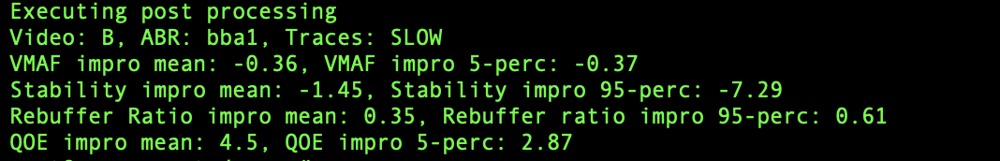

# Welcome to Segue!

Welcome! 
We will now guide you in the setup and first run of Segue.
Segue is a video preparation system that adapts video
chunking depending on the expected rate adaptation and
network behavior.


If you haven't yet, please read our [paper](https://escholarship.org/uc/item/8m39f25q)
published at JSys!

## Install

Install docker according to your OS and make sure your current user is able to
use docker. In a default installation on Ubuntu Linux, only root is allowed to
run docker containers. In this case, make sure to follow the instructions as
root user.

Download the docker image (about 2 GB) with the following command:

```
docker pull melissalicc/maya
```

Clone or unpack Segue, open a terminal and change directory to the `docker`
subdirectory: `cd segue/docker`. Then, enter the docker container with the
`run.sh` command. This script uses some relative paths, so it is important to
run it while being in the `docker` directory. (I.e don't do a `./docker/run.sh`
this will not work).

This script will start bash within the docker container, the segue directory
will be mounted in `/segue`. So after you do a `cd /segue` you can invoke
the execution script.


## Configuration of Segue strategies

In `./configs` all the details for configure Segue segmentation
and augmentation strategies are explained. 
Also, the preset of configurations tested in our paper are made available.


## Executions

To execute Segue, simply run the following command.

`./execute_segue.sh <Vid> <Abr> <Tr> <Vmaf> <Gr> <Aug> {<R_Gr> <R_Aug}` 

The parameters description is the following:

* **Vid**: Refers to the video ID. Please map your video ID to its configuration file in `make_run/LOC.py`
* **Abr**: Refers to the ABR under test. The implemented ABRs are a rate-based (*RB*), buffer-based (*BB*), and two versions of robust MPC (*RMPC-A* for the version that uses VMAF, *RMPC-O* for the version that uses bitrate).
* **Tr**: Refers to the trace set under test. Map the trace set ID to their location in the file `make_run/LOC.py`.
* **Vmaf**: Refers to the VMAF model at which the evaluation should be run. Acceptable values are MOBILE/HDTV/4K.
* **Gr**: Refers to the grouping strategy utilised by Segue. A description of the accepted parameters is below.
	- **K-{L}**:  Constant segmentation strategy. L can be either 1, 2, 3, 4 or 5.
	- **GOP-{L}**: GOP based segmentation strategy from [related works](https://dl.acm.org/doi/abs/10.1145/3339825.3391858). L can be either 1, 2, 3, 4 or 5.
	- **TIME**: Time based heuristic, referred in the paper as *Time*.
	- **BYTES**: Time based heuristic, referred in the paper as *Bytes*.
	- **TIME+BYTES**: Time based heuristic, referred in the paper as *Time+Bytes*.
	- **SIM**: Short term simulation based segmentation strategy, referred in the paper as *Sim*.	
	- **WIDE-EYE**: Short term simulation based segmentation strategy, referred in the paper as *WideEye*.
* **Aug**: Refers to the augmentation strategy utilised by Segue. A description of the accepted parameters is below.
	- **NONE**:  No augmentation is applied. This is the option to be utilised in case one wants to isolate and test the performance of segmentation only.
	- **LAMBDA-B**: Augmentation heuristic referred in the paper as $\lambda_b$.
	- **LAMBDA-V**: Augmentation heuristic referred in the paper as $\lambda_v$.
	- **LAMBDA-BV-{B}-{V}**: Augmentation heuristic referred in the paper as $\lambda_{bv}$. B and V refer to the bitrate and VMAF thresholds respectively. B value can be 5, 10 and 15, while V values are in the range of [5, 15[.
	- **SIGMA-BV**: Simulation based augmentation strategy referred in the paper as $\sigma_{bv}$.
	- **CBF-{T}**: CBF chunk selection strategy from [related works](https://dl.acm.org/doi/10.1145/3304109.3306231). Threshold values T can be 40, 60 and 80.
	- **SIVQ-{T}**: SIVQ chunk selection strategy from [related works](https://ieeexplore.ieee.org/document/7745907). Threshold values T can be 5, 10 and 15.
* **R_Gr**, **R_Aug** (OPTIONAL): refer to the reference segmentation and augmentation strategy from which Segue performance has to be evaluate against. They follow the same parameter alphabet of **Gr** and **Aug** and, if not specified otherwise, they are set to *K-5* and *NONE*.

## Example

If I would like, for example, to verify *WideEye segmentation performance, absent of augmentation* for video B and a buffer based algorithm for a trace set denominted SLOW with the VMAF MOBILE perceptual quality model, you would run:

`./execute_segue.sh B BB SLOW MOBILE WIDE-EYE NONE`

An example of output will be:




